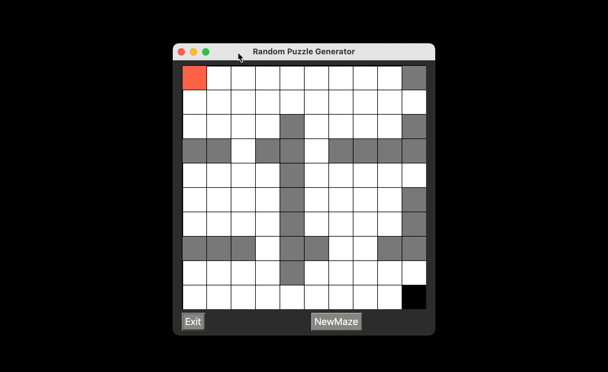

This is the companion repo for a Medium tutorial post on how to start making a maze in Python and PysimpleGUI.

For an orderly step by step check the post:

<a href="https://k3no.medium.com/build-a-maze-with-python-920ac2266fe7" target="_blank">Build a Maze with Python</a>

This repo is just the gists used in repo form, the final script  if you just want to copy paste or tinker is [mazeCreate.py](https://github.com/KenoLeon/Medium-Mazes/blob/main/mazeCreate.py) But be aware that the mazes are not always solvable, consult the post for more.

And the final product:

Cheers !